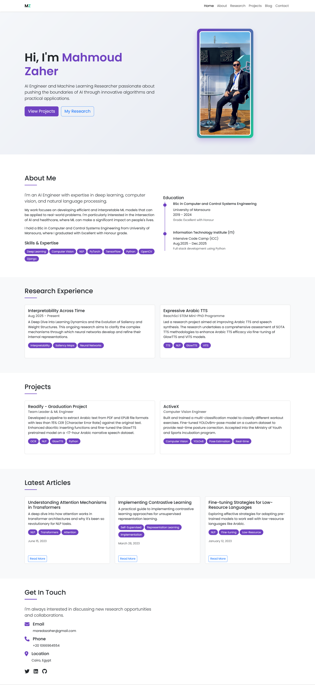
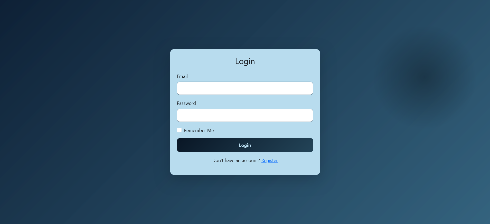
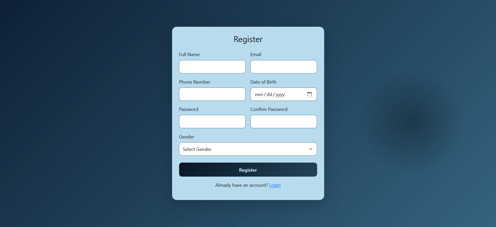

# ITI Bootstrap Course Labs

A collection of responsive web projects built with **Bootstrap 5** as part of ITI's Bootstrap Course.

## 🌐 Live Demo

The labs are deployed using GitHub Pages:  
[Personal Portfolio](https://zaher-m.github.io/ITI-Bootstrap-Course-Labs/)


## 📝 Usage
- Clone the repository:
```bash
git clone https://github.com/zaher-m/ITI-Bootstrap-Course-Labs.git
```

---

## 📘 Labs Overview

### 🔹 Lab 1: Personal Portfolio Page
Build a responsive portfolio page that introduces you and showcases my personal identity.

📸 **Screenshots**  

  


---

## 🔹 Lab 2: Login & Register Forms
Create responsive and modern **Login** and **Register** forms using Bootstrap.

### 📸 **Screenshots**  
  
  
---

### ✨ Features

- **Responsive Design**: Works seamlessly across all devices  
- **Professional Portfolio**: Clean presentation of skills, experience, and projects  
- **Modern UI Forms**: Stylish Login & Register forms with validation logic  
- **GitHub Pages Deployment**

---


## 🔹 Lab 3: AI Learning Academy Website

A responsive educational website for an AI Learners. It features a modern design with a sticky header, a hero section, learning paths, featured courses, testimonials, FAQs, and a footer with a newsletter subscription.

### 🛠️ Technologies Used

- JavaScript (ES6+)  
- HTML5  
- CSS3  
- Bootstrap 5.3.0  
- Font Awesome 6.4.0  
- Google Fonts (Poppins)  
